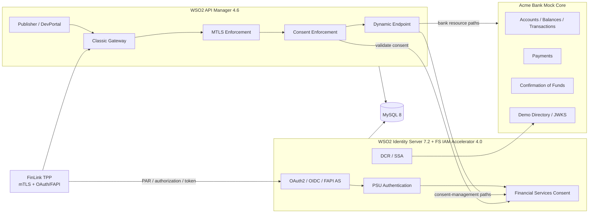

# WSO2 Financial Services / Open Banking End-to-End Demo

A reproducible local Financial Services and Open Banking laboratory built with:

* **WSO2 API Manager 4.6.0**
* **WSO2 Identity Server 7.2.0**
* **WSO2 Financial Services IAM Accelerator 4.0.0**
* **WSO2 Financial Services APIM Mediation Policies 1.0.0**
* **MySQL 8**
* A purpose-built **Go mock banking backend**
* Automatically generated **bank, platform and TPP PKI**
* Automated APIM/IS/Financial Services provisioning and verification

The repository demonstrates how API management, OAuth/OIDC, FAPI security controls, customer authentication, regulatory consent and bank-domain authorization fit together in a realistic Financial Services architecture.

> **Important**
>
> This is a local technical demonstration and learning environment.
>
> It is not a production deployment template and it is not a claim of regulatory or OpenID certification.
>
> Read [SECURITY.md](SECURITY.md) before using the environment.

---

# 1. What this demo is intended to teach

The scenario uses three logical actors:

* **Acme Bank** — the Account Servicing Payment Service Provider / API provider.
* **FinLink** — the external TPP / fintech consuming the APIs.
* **The PSU** — the bank customer who authenticates and grants consent.

The demo answers a much broader question than simply:

> “Can an OAuth token call an API?”

It demonstrates the complete trust chain:

```text
TPP registration and trust
        ↓
OAuth/FAPI client security
        ↓
Customer authentication
        ↓
Explicit banking consent
        ↓
Consent-bound access token
        ↓
mTLS-protected API invocation
        ↓
APIM policy enforcement
        ↓
Financial Services consent validation
        ↓
Signed consent context
        ↓
Bank resource-server enforcement
        ↓
Account / payment / funds domain service
```

The important architectural idea is that these responsibilities remain separate.

WSO2 does not pretend to be the bank's core banking system, and the mock bank does not pretend to be the OAuth authorization server.

---

# 2. Compatibility baseline

The repository uses the Financial Services Accelerator 4.0 compatibility baseline:

| Component                                  | Version |
| ------------------------------------------ | ------: |
| WSO2 API Manager                           |   4.6.0 |
| WSO2 Identity Server                       |   7.2.0 |
| Financial Services IAM Accelerator         |   4.0.0 |
| Financial Services APIM Mediation Policies |   1.0.0 |
| MySQL                                      |     8.x |

The runtime contains compatibility gates because a Docker container being `Up` does not prove that:

* Financial Services endpoints are installed;
* the APIM ↔ IS Key Manager integration works;
* the policies are correctly deployed;
* API revisions are deployed;
* TLS trust is correct;
* the OAuth application has the expected FAPI settings;
* the bank contains the expected demo data.

---

# 3. Architecture



---

# 4. Responsibility boundaries

## API Manager

API Manager is responsible for:

* API product lifecycle;
* Publisher and Developer Portal;
* applications and subscriptions;
* API revisions and Gateway deployment;
* throttling/governance;
* mTLS enforcement;
* OAuth token validation;
* Financial Services mediation policies;
* consent-enforcement integration;
* dynamic routing between Financial Services services and bank services.

## Identity Server

Identity Server is responsible for:

* OAuth 2.0;
* OpenID Connect;
* FAPI application configuration;
* customer authentication;
* authorization code issuance;
* PAR;
* PKCE processing;
* signed request-object validation;
* client authentication;
* certificate-bound tokens;
* application roles and API scopes.

## Financial Services IAM Accelerator

The Accelerator adds the Financial Services domain:

* consent lifecycle;
* pre-authorisation consent processing;
* consent validation;
* banking-specific OAuth extensions;
* DCR/SSA extensions;
* Financial Services service-extension points;
* consent information consumed by Gateway enforcement.

## Financial Services APIM Mediation Policies

Protected Financial Services resources use this policy order:

1. **MTLS Enforcement**
2. **Consent Enforcement**
3. **Dynamic Endpoint**

Dynamic Endpoint is deliberately last because it determines the final Synapse destination.

## Mock Bank

The Go backend represents the bank system-of-record boundary.

It owns:

* customers;
* accounts;
* balances;
* transactions;
* beneficiaries;
* domestic payments;
* Confirmation of Funds;
* deterministic demo data;
* demo directory/JWKS material;
* resource-level signed-consent enforcement for Accounts, Payments and Confirmation of Funds.

Consent state itself remains in the Financial Services / Identity Server domain.

---

# 5. A stronger Accounts security model

Accounts is the most complete end-to-end path in the repository.

A successful Accounts request is not authorised merely because:

* the caller has a bearer token;
* the token contains the `accounts` scope;
* or APIM accepted the TLS connection.

The complete path is:

```text
TPP
 │
 │ Authorization: Bearer <token>
 │ client mTLS certificate
 ▼
APIM Gateway
 │
 ├─ validate transport/client certificate
 ├─ validate OAuth token/scope
 └─ call Financial Services consent validation
       │
       ▼
Identity Server / Accelerator
       │
       └─ returns signed consent information
              │
              ▼
APIM forwards Account-Request-Information
              │
              ▼
Acme Bank backend
       │
       ├─ verify JWS signature with pinned IS public certificate
       ├─ require Authorised consent
       ├─ require Accounts consent type
       ├─ derive active/primary authorised account mappings
       └─ restrict the requested resource
```

The bank therefore independently fails closed if the signed consent context is missing or invalid.

This provides an important resource-server control beyond simply trusting that an upstream Gateway already performed authorization.

---

# 6. Real PSU account selection

The stock Financial Services Accelerator demo authorization page uses placeholder/dummy account identifiers.

This repository replaces those placeholders through the supported Financial Services service-extension mechanism.

For the deterministic demo personas:

| User    | Bank customer | Accounts presented during Accounts consent |
| ------- | ------------- | ------------------------------------------ |
| `alice` | `CUS-001`     | `ACC-001`, `ACC-002`, `ACC-003`            |
| `bob`   | `CUS-002`     | `ACC-004`, `ACC-005`, `ACC-006`            |
| `carol` | `CUS-003`     | `ACC-007`, `ACC-008`, `ACC-009`            |
| `demo`  | `CUS-004`     | `ACC-010`, `ACC-011`, `ACC-012`            |

The extension also preserves type-aware consent-screen data for:

* Accounts;
* Payments;
* Confirmation of Funds.

Resource-server signed-consent enforcement is implemented across all three principal domains, with domain-specific authorization checks:

* **Accounts** — verifies the signed consent context, requires an `Authorised` Accounts consent, derives the authorised account mappings and restricts requested resources and permissions accordingly.
* **Payments** — verifies the signed consent context, requires an `Authorised` Payments consent, binds execution to the submitted `ConsentId`, and requires the submitted `Initiation` and `Risk` objects to match the authorised consent. Payment ownership and idempotency are consent-scoped, preventing cross-consent resource access.
* **Confirmation of Funds** — verifies the signed consent context, requires an `Authorised` Confirmation of Funds consent, derives the debtor account from the consent rather than from caller-controlled input, enforces consent identity and expiry, and validates the requested amount and currency against the consent-bound account.

The exact checks differ because each banking domain protects different resources, but all three fail closed at the bank boundary when the required signed consent context is absent or invalid.

---

# 7. APIs

The bootstrap automatically imports, deploys and publishes three principal Open Banking-style APIs.

## Accounts

Context:

```text
/open-banking/v3.1/aisp
```

Capabilities include:

* account-access consent creation/retrieval;
* Accounts;
* individual Account;
* Balances;
* Transactions;
* Beneficiaries.

OAuth scope:

```text
accounts
```

## Payments

Context:

```text
/open-banking/v3.1/pisp
```

Capabilities include:

* payment-consent creation/retrieval;
* domestic-payment initiation;
* payment status;
* `x-idempotency-key` handling.

OAuth scope:

```text
payments
```

## Confirmation of Funds

Context:

```text
/open-banking/v3.1/cbpii
```

Capabilities include:

* funds-confirmation consent;
* funds availability query;
* amount/currency input;
* boolean availability response without returning the account balance.

OAuth scope:

```text
fundsconfirmations
```

## Dynamic Client Registration

A separate DCR definition is included under:

```text
apis/dcr.yaml
```

It is intentionally separate from AISP/PISP/CBPII because registration has different trust, payload and transport semantics.

The demo DCR surface models:

* registration;
* registration read;
* registration update;
* signed software metadata.

---

# 8. Demo banking data

The Go backend creates deterministic data every time the container starts.

Typical dataset:

* 8 customers;
* 20 accounts;
* 500+ transactions;
* current accounts;
* savings accounts;
* credit-card-style accounts;
* BRL, USD and EUR balances;
* beneficiaries;
* payment records;
* Confirmation of Funds responses.

Example summary:

```bash
curl -fsS http://localhost:8080/demo/summary | jq .
```

Example:

```json
{
  "accounts": 20,
  "beneficiaries": 60,
  "customers": 8,
  "payments": 0,
  "scenario": "Acme Bank / FinLink TPP",
  "transactions": 554
}
```

No real customer information is used.

---

# 9. Demo identities

`./start.sh` provisions deterministic users.

| User    | Password      | Intended scope        |
| ------- | ------------- | --------------------- |
| `alice` | `Alice@12345` | Accounts              |
| `bob`   | `Bob@12345`   | Payments              |
| `carol` | `Carol@12345` | Confirmation of Funds |
| `demo`  | `Demo@12345`  | All three             |

The bootstrap also creates:

```text
OpenBankingDemoApp
```

and subscribes it to the demo APIs.

Application credentials and short-lived runtime material are stored under:

```text
.state/demo-access/
```

This directory is ignored by Git.

---

# 10. Security artifacts

`./scripts/generate-certs.sh` creates disposable demo PKI:

* local Root CA;
* APIM server certificate;
* IS server certificate;
* TPP client certificate;
* TPP private key;
* PKCS#12 server keystores;
* trust material;
* TPP JWKS;
* pinned IS public certificate used by the mock bank.

Generated artifacts live under:

```text
.state/certs/
```

They are local demo secrets and must never be committed.

The TPP certificate uses client-authentication EKU and represents FinLink's transport identity.

---

# 11. FAPI characteristics of the current baseline

The current main browser flow demonstrates a FAPI 1.0 Advanced-style Financial Services authorization profile using:

* confidential OAuth client;
* `tls_client_auth`;
* mTLS sender-constrained access token;
* signed PS256 request object;
* Pushed Authorization Requests;
* PKCE S256;
* hybrid `code id_token` authorization;
* Financial Services consent binding;
* consent-specific `consent_id`;
* certificate confirmation (`cnf`) in the access token.

The bootstrap explicitly normalizes Hybrid Flow because the Financial Services authorization sequence currently depends on:

```text
response_type=code id_token
```

## Important FAPI 2.0 distinction

This repository must **not** describe that hybrid flow as FAPI 2.0.

The final FAPI 2.0 Security Profile uses a different authorization profile, including:

* `response_type=code`;
* no ID token in the front-channel;
* client-authenticated PAR;
* PKCE S256;
* authorization-response issuer validation;
* sender-constrained access tokens;
* mTLS or DPoP;
* mTLS or `private_key_jwt` client authentication.

A dedicated FAPI 2.0 lab is planned separately.

Passing the local demo tests is not equivalent to OpenID Foundation certification.

---

# 12. Quick start

## Prerequisites

Install:

* Docker Desktop or Docker Engine;
* Docker Compose v2;
* OpenSSL;
* Bash;
* curl;
* jq;
* Git.

Recommended local Docker memory:

```text
12 GB minimum
16 GB preferred
```

Internet access is required on the first run unless the required artifacts have already been placed under `dist/`.

## Clone

```bash
git clone <repository>
cd demo-financial-services-accelerator
```

## Configure

```bash
cp .env.example .env
chmod 600 .env
```

## Start from a clean environment

```bash
./start.sh --fresh
```

`--fresh` destroys previous demo runtime state before rebuilding.

To reuse existing local runtime state:

```bash
./start.sh --reuse
```

---

# 13. What `start.sh` does

The startup is intentionally much more than `docker compose up`.

It:

1. checks prerequisites;
2. cleans previous state when requested;
3. generates the local PKI;
4. prepares pinned dependencies;
5. prepares the Financial Services IAM Accelerator;
6. prepares Financial Services APIM mediation policies;
7. prepares compatibility libraries;
8. builds the mock bank;
9. builds IS 7.2 with Accelerator 4.0;
10. builds APIM 4.6 with Financial Services mediation artifacts;
11. starts MySQL;
12. initializes APIM/IS/Financial Services database schemas;
13. starts Identity Server;
14. starts API Manager;
15. imports the Financial Services policies;
16. configures APIM ↔ IS Financial Services Key Manager integration;
17. imports the banking APIs;
18. creates revisions and deploys them;
19. publishes the APIs;
20. creates `OpenBankingDemoApp`;
21. subscribes the application;
22. creates/normalizes the demo identities and roles;
23. configures the FAPI OAuth application;
24. enforces required Hybrid Flow;
25. installs the TPP certificate;
26. authorizes the application scopes;
27. mints and validates an application-level FAPI JWT;
28. performs a Gateway smoke test;
29. executes runtime verification gates.

Successful startup ends with:

```text
All implemented runtime gates passed

Demo is ready.
```

---

# 14. Service endpoints

| Component                  | Address                              |
| -------------------------- | ------------------------------------ |
| APIM Publisher             | `https://localhost:9443/publisher`   |
| APIM Developer Portal      | `https://localhost:9443/devportal`   |
| APIM Admin                 | `https://localhost:9443/admin`       |
| APIM Gateway               | `https://localhost:8243`             |
| Identity Server Console    | `https://localhost:9446/console`     |
| Identity Server My Account | `https://localhost:9446/myaccount`   |
| Mock Bank                  | `http://localhost:8080`              |
| Demo data summary          | `http://localhost:8080/demo/summary` |

Default administrative credentials:

```text
admin / admin
```

These are intentionally demo-only credentials.

---

# 15. Verification cookbook

## Lab 0 — Verify the environment

Run:

```bash
./scripts/verify.sh
```

The verification checks include:

* mock-bank health;
* mock-bank data volume;
* IS JWKS;
* FAPI OAuth application state;
* required hybrid `code id_token` flow;
* Financial Services resource access control;
* IS Financial Services authentication;
* APIM management surface;
* APIM TLS identity;
* Financial Services consent endpoint;
* Financial Services mediation policies;
* all three banking APIs;
* TPP certificate;
* pinned IS public certificate;
* shared truststore.

Do not consider a demo successful merely because every Docker container says `Up`.

---

# 16. Lab 1 — Inspect the banking domain

```bash
curl -fsS http://localhost:8080/demo/summary | jq .
```

This endpoint is intentionally safe to call directly.

Protected Accounts domain endpoints are different.

A direct request without Financial Services consent context:

```bash
curl -sS \
  -o /tmp/direct-no-consent.json \
  -w '%{http_code}\n' \
  http://localhost:8080/api/fs/backend/services/accounts/accountservice/accounts

cat /tmp/direct-no-consent.json
```

should return:

```text
401
```

because the bank refuses Accounts access without signed Financial Services consent information.

This is expected behavior.

---

# 17. Lab 2 — Inspect TPP trust

```bash
openssl x509 \
  -in .state/certs/tpp.crt \
  -noout \
  -subject \
  -issuer \
  -fingerprint \
  -sha256
```

Explain the difference between:

* the TPP's OAuth application identity;
* the TPP's transport identity;
* the bank/API Gateway trust anchor.

In a production ecosystem the local demo CA would be replaced by the regulatory, eIDAS or ecosystem-specific trust infrastructure.

---

# 18. Lab 3 — Application token is not customer consent

The bootstrap creates an application-level token for infrastructure testing.

Inspect:

```bash
jq '{
  token_type,
  scope,
  expires_in
}' .state/demo-access/application-token.json
```

The token can prove that the OAuth client and API application are correctly configured.

It does **not** represent PSU authorization.

Calling a consent-protected Accounts endpoint with only the application token should fail at the consent layer.

This distinction is fundamental:

```text
OAuth client authorization ≠ customer consent
```

---

# 19. Lab 4 — Real Accounts consent

The full Accounts path requires a real browser authorization.

The conceptual sequence is:

```text
1. Obtain application token
2. POST account-access-consents through APIM
3. Receive ConsentId / AwaitingAuthorisation
4. Generate PKCE verifier/challenge
5. Create signed PS256 request object
6. Push authorization request to PAR
7. Receive request_uri
8. Open authorization endpoint in browser
9. Login as Alice
10. Select ACC-001 / ACC-002 / ACC-003
11. Approve consent
12. Receive authorization code
13. Validate OAuth state
14. Exchange code using mTLS + PKCE
15. Validate consent_id and cnf
16. Call Accounts through APIM
```

The authorization screen should show Alice's actual mock-bank accounts instead of hard-coded Accelerator placeholders.

Expected selection:

```text
ACC-001
ACC-002
ACC-003
```

The resulting user access token should be:

* scoped for Accounts;
* bound to the approved consent;
* certificate-bound;
* issued only after actual PSU authentication/approval.

`demo/run.sh` provides the current terminal-oriented walkthrough support.

A browser-based Lab Console is a planned enhancement to remove the need for manual shell orchestration and callback copying.

---

# 20. Lab 5 — Verify account isolation

After a successful Alice consent, the collection endpoint:

```text
GET /open-banking/v3.1/aisp/3.1.0/accounts
```

must expose exactly:

```text
ACC-001
ACC-002
ACC-003
```

Expected individual-resource behavior:

| Request   | Expected |
| --------- | -------: |
| `ACC-001` |      200 |
| `ACC-003` |      200 |
| `ACC-004` |      403 |
| `ACC-020` |      403 |

Expected subresource behavior:

| Request                | Expected |
| ---------------------- | -------: |
| `ACC-001/balances`     |      200 |
| `ACC-001/transactions` |      200 |
| `ACC-004/balances`     |      403 |
| `ACC-004/transactions` |      403 |

This proves that OAuth scope alone does not expose every account in the mock bank.

---

# 21. Lab 6 — Negative security tests

The demo should deliberately demonstrate failures.

## No mTLS

A consent-bound token without the required client certificate should be rejected.

Expected:

```text
401
```

## Application token without PSU consent

Expected:

```text
401
```

at the consent layer.

## Missing signed consent context at the bank

Expected:

```text
401
```

## Valid consent, unauthorised account

Expected:

```text
403
```

## Wrong OAuth scope

Expected rejection by OAuth/Gateway authorization.

## Invalid or expired consent

Expected rejection by Financial Services consent enforcement.

## Repeated payment idempotency key

Expected:

```text
same payment
```

rather than creation of a duplicate payment.

These negative scenarios are as important as the successful path.

---

# 22. Payments lab

Payments demonstrate:

```text
payment consent
        ↓
PSU authorization
        ↓
payments-scoped token
        ↓
domestic payment
        ↓
x-idempotency-key
        ↓
payment status
```

The mock backend can:

* create a payment;
* debit the in-memory account;
* create a corresponding booked transaction;
* return the same logical payment for a repeated idempotency key.

## Domain consent enforcement

Payment execution is bound to the authorised Financial Services consent at the bank resource-server boundary.

The bank-side validation path:

* verifies the signed consent context;
* requires an `Authorised` Payments consent;
* requires the submitted `ConsentId` to identify the authorised consent;
* requires the submitted `Initiation` object to match the authorised payment terms;
* requires the submitted `Risk` object to match the authorised Risk context;
* scopes payment ownership and retrieval to the consent;
* scopes idempotency to both the consent and the idempotency key;
* rejects cross-consent access to a payment created under another consent.

This means an otherwise valid `payments` token cannot change the authorised payment terms or use one consent to retrieve resources belonging to another.

---

# 23. Confirmation of Funds lab

The Confirmation of Funds API accepts:

```text
ConsentId
Reference
InstructedAmount.Amount
InstructedAmount.Currency
```

The caller does **not** supply an `AccountId`.

Instead, the bank derives the debtor account from the authorised Confirmation of Funds consent carried in the signed Financial Services consent context.

The resource-server validation path:

* verifies the signed consent context;
* requires an `Authorised` Confirmation of Funds consent;
* requires the request `ConsentId` to match the authorised consent;
* enforces consent expiry when an expiration is present;
* resolves the debtor account from the authorised consent;
* validates the requested currency against that consent-bound account;
* determines whether the requested amount is available.

A successful confirmation returns HTTP `201` with a unique `FundsConfirmationId` and a boolean `FundsAvailable` result.

The result intentionally does not disclose the actual account balance, preserving data minimization.

---

# 24. DCR lab

The repository includes a Financial Services Dynamic Client Registration API definition.

The long-term demonstration should show:

```text
TPP software identity
        ↓
Software Statement Assertion
        ↓
Directory JWKS
        ↓
signed registration request
        ↓
DCR validation
        ↓
OAuth client
        ↓
read/update/delete lifecycle
```

The current directory/JWKS implementation is a local simulation.

It is not a regulatory directory.

---

# 25. Logs

View all service logs:

```bash
./logs.sh
```

Or inspect individual services:

```bash
docker logs -f wso2-ob-apim
docker logs -f wso2-ob-is
docker logs -f wso2-ob-bank-backend
```

Do not publish logs containing:

* access tokens;
* refresh tokens;
* private keys;
* client secrets;
* real customer information.

---

# 26. Tests

Run backend and shell tests:

```bash
make test
```

Run runtime verification:

```bash
make verify
```

Or directly:

```bash
./scripts/verify.sh
```

Before committing:

```bash
./scripts/pre-commit-audit.sh
```

---

# 27. Lifecycle commands

Start:

```bash
./start.sh
```

Explicit fresh start:

```bash
./start.sh --fresh
```

Reuse existing state:

```bash
./start.sh --reuse
```

Stop while preserving state:

```bash
./stop.sh
```

View logs:

```bash
./logs.sh
```

Destroy local runtime state:

```bash
./reset.sh
```

---

# 28. Repository layout

```text
.
├── apis/
│   ├── accounts.yaml
│   ├── payments.yaml
│   ├── cof.yaml
│   └── dcr.yaml
│
├── backend/
│   └── Go mock-bank implementation
│
├── bootstrap/
│   ├── APIM/IS bootstrap
│   └── Financial Services policy specifications
│
├── config/
│   ├── apim/
│   ├── is/
│   └── mysql/
│
├── demo/
│   ├── requests/
│   └── run.sh
│
├── dist/
│   └── downloaded/local WSO2 artifacts
│
├── docker/
│   └── custom runtime images
│
├── docs/
│   ├── ARCHITECTURE.md
│   ├── COMPATIBILITY.md
│   ├── DEMO-STORY.md
│   └── TROUBLESHOOTING.md
│
├── patches/
│   └── compatibility/runtime patches
│
├── scripts/
│   ├── bootstrap-demo-access.sh
│   ├── check-is-fs-access-control.sh
│   ├── check-prereqs.sh
│   ├── clean-demo-environment.sh
│   ├── demo-token.sh
│   ├── extract-policies.sh
│   ├── generate-certs.sh
│   ├── init-db.sh
│   ├── pre-commit-audit.sh
│   ├── prepare-accelerators.sh
│   ├── prepare-apim-policies.sh
│   ├── prepare-compatibility-libs.sh
│   ├── prepare-dependencies.sh
│   ├── verify.sh
│   └── wait-products.sh
│
├── vendor/compat/
├── docker-compose.yml
├── Makefile
├── SECURITY.md
├── start.sh
├── stop.sh
├── reset.sh
└── logs.sh
```

---

# 29. Artifact distribution modes

The Financial Services IAM Accelerator and APIM mediation artifacts use different packaging paths.

The default clean install obtains/prepares pinned versions.

The repository also supports controlled/local artifact modes through `dist/`.

This makes it possible to use the demo in:

* normal Internet-connected development;
* repeatable workshops;
* controlled/offline preparation.

Do not substitute arbitrary Accelerator or product versions without revalidating compatibility.

---

# 30. Current security posture

This repository deliberately contains local-demo concessions, including:

* `admin/admin`;
* disposable database passwords;
* local CA;
* local server/TPP private keys;
* selected `curl -k` calls;
* MySQL TLS disabled on the private demo network;
* broad local CORS;
* localhost management endpoints.

All published Docker ports should remain localhost-only.

Never reuse the demo credentials or PKI outside the workstation.

Never publish locally built IS/APIM images containing demo private keys.

See [SECURITY.md](SECURITY.md).

---

# 31. What this repository does NOT claim

The demo is not:

* a production topology;
* an HA reference architecture;
* a regulatory directory;
* an HSM/KMS deployment;
* a complete OBIE schema implementation;
* a complete Open Finance Brasil implementation;
* an OpenID Foundation certification;
* a FAPI 2.0-certified deployment;
* a replacement for production consent governance;
* a substitute for WSO2 support/compatibility validation.

Its purpose is to make the architecture and security controls observable and reproducible.

---

# 32. FAPI 2.0 roadmap

FAPI 2.0 should be implemented as a **separate lab profile**, not by renaming the existing hybrid flow.

Target FAPI 2.0 Security Profile lab:

```text
Authorization Code only
        +
PAR
        +
PKCE S256
        +
authorization response issuer validation
        +
metadata-driven endpoint discovery
        +
mTLS or DPoP sender constraint
        +
mTLS or private_key_jwt client authentication
```

Planned tests:

* code-only authorization;
* PAR mandatory;
* PKCE S256 mandatory;
* authorization `iss` validation;
* mTLS-bound access token;
* DPoP-bound access token;
* DPoP replay/nonce behavior;
* `private_key_jwt`;
* wrong certificate;
* wrong DPoP key;
* token replay;
* metadata issuer mismatch;
* refresh-token sender constraint.

A successful local implementation must still not be described as FAPI 2.0 certified until it passes the official OpenID Foundation conformance suite.

---

# 33. FAPI 2.0 Message Signing roadmap

An optional advanced track should demonstrate:

* signed authorization request at PAR;
* JAR validation;
* JARM signed authorization response;
* signed JWT introspection where supported;
* signature/key rotation;
* negative signature tests.

This track is intentionally separate from the base FAPI 2.0 Security Profile.

---

# 34. Open Finance roadmap

Open Finance should be treated as a broader domain track rather than merely adding more OAuth scopes.

Potential additions include:

* richer consent resources;
* Rich Authorization Requests;
* recurring consent;
* consent amendment;
* consent revocation;
* multi-account consent;
* multi-authorization;
* joint accounts;
* broader data domains;
* standing orders;
* direct debits;
* loans;
* cards;
* investments;
* insurance;
* FX;
* customer/profile data;
* event notifications;
* regulatory directory lifecycle;
* certificate rotation;
* software-statement lifecycle;
* CIBA;
* No-Redirect / decoupled journeys where applicable.

A dedicated Open Finance Brasil profile should be implemented separately from generic FAPI 2.0 because the regulatory profile has its own versions, directory, DCR, consent and conformance requirements.

---

# 35. Planned Financial Services Lab Console

The largest usability improvement is a browser-based local laboratory.

Proposed architecture:

```text
lab-console/
├── server/       Go lab orchestrator
├── web/          React + TypeScript UI
└── labs/         declarative lab definitions
```

The browser must never receive the TPP private key.

Cryptographic operations remain server-side.

The Lab Console should include:

## Dashboard

Show:

* APIM health;
* IS health;
* Gateway health;
* Bank health;
* DB state;
* installed product versions;
* active API revisions;
* Key Manager state.

## Architecture

Interactive request path:

```text
TPP → APIM → IS/Consent → APIM → Bank
```

Highlight the component currently processing each step.

## Lab Catalog

Examples:

* Platform health
* TPP trust
* Accounts consent
* Account aggregation
* Payment initiation
* Confirmation of Funds
* DCR
* mTLS negative tests
* OAuth scope tests
* Consent tests
* FAPI 1 Advanced
* FAPI 2.0
* DPoP
* JARM
* Open Finance Brasil
* CIBA

## Consent Wizard

Allow the operator to:

1. create consent;
2. inspect consent data;
3. generate authorization request;
4. click **Authenticate as Alice**;
5. select accounts;
6. approve;
7. automatically receive the OAuth callback;
8. exchange the authorization code;
9. inspect the consent-bound token;
10. execute protected API calls.

No callback URL should need to be copied into a terminal.

## Token Inspector

Decode safely:

* JWT header;
* issuer;
* subject;
* client ID;
* scopes;
* `consent_id`;
* `cnf`;
* expiry;
* signature result.

Tokens should be redacted by default.

## Consent Context Inspector

Display:

* consent ID;
* status;
* type;
* permissions;
* authorization resources;
* account mappings;
* selected accounts;
* validity;
* signed `Account-Request-Information`;
* signature verification status.

## Gateway Trace

For each call display:

```text
✓ mTLS
✓ OAuth token
✓ scope
✓ consent status
✓ signed consent context
✓ account mapping
✓ backend authorization
```

## API Explorer

Provide buttons for:

```text
GET Accounts
GET Account
GET Balances
GET Transactions
POST Payment
GET Payment
POST Funds Confirmation
```

Every operation should show:

* expected result;
* actual HTTP status;
* redacted request;
* redacted response;
* control that allowed/denied the request.

## Security Labs

One-click negative scenarios:

```text
No certificate             → 401
Wrong certificate          → reject
Application token only     → 401
No consent context         → 401
Unauthorised account       → 403
Wrong scope                → reject
Tampered ARI               → 401
Expired consent            → reject
Revoked consent            → reject
Repeated payment key       → no duplicate
```

## Evidence

Each lab should generate a safe report containing:

* lab name;
* run ID;
* timestamps;
* interaction IDs;
* certificate fingerprints;
* consent ID;
* selected JWT claims;
* HTTP statuses;
* assertions;
* pass/fail result.

Secrets and complete tokens must not be included.

---

# 36. Recommended development priorities

## Priority 1 — Make the demo observable

Build the Financial Services Lab Console and move the complete Accounts browser flow into it.

## Priority 2 — Extend browser E2E coverage

Move the proven Payments and Confirmation of Funds authorization flows into the planned Financial Services Lab Console alongside Accounts.

Preserve automated assertions for consent binding, domain authorization and negative security cases so the browser-driven demonstrations no longer depend on manual callback handling.

## Priority 3 — Security regression suite

Automate:

* mTLS failures;
* scope failures;
* consent failures;
* wrong-resource failures;
* ARI signature failures;
* token replay;
* certificate mismatch.

## Priority 4 — FAPI 2.0 learning profile

Add:

* code-only flow;
* issuer validation;
* metadata-driven client;
* DPoP;
* `private_key_jwt`;
* optional JARM/Message Signing.

## Priority 5 — Conformance

Integrate the official OpenID Foundation conformance suite and clearly distinguish:

```text
demonstrated
```

from:

```text
conformant
```

and:

```text
certified
```

## Priority 6 — Open Finance profiles

Add:

* regulatory-style directory;
* stronger DCR/SSA lifecycle;
* RAR;
* CIBA;
* additional Open Finance data domains;
* ecosystem-specific profile configurations.

---

# 37. Production differences

A production Financial Services deployment additionally needs, among other controls:

* distributed/HA APIM architecture;
* distributed/HA Identity Server architecture;
* enterprise database topology;
* HSM/KMS-backed keys;
* enterprise/regulatory PKI;
* certificate lifecycle automation;
* secrets vault;
* WAF/ingress;
* network segmentation;
* rate limiting and DoS protection;
* SIEM;
* audit retention;
* APM/observability;
* backup;
* disaster recovery;
* vulnerability management;
* patch/update governance;
* compliance evidence;
* operational runbooks;
* secure software supply chain;
* regulatory conformance testing.

The local demo intentionally optimizes for visibility, reproducibility and education rather than production hardening.

---

# 38. Supporting documentation

Before presenting the environment, also read:

* [Architecture](docs/ARCHITECTURE.md)
* [Demo Story](docs/DEMO-STORY.md)
* [Compatibility](docs/COMPATIBILITY.md)
* [Troubleshooting](docs/TROUBLESHOOTING.md)
* [Security](SECURITY.md)

---

# 39. The message of the demo

The value of the repository is not that it runs several Docker containers.

The value is that it makes a financial-grade trust chain observable:

```text
TPP trust
  → application authorization
  → customer authentication
  → explicit consent
  → sender-constrained token
  → governed API
  → consent enforcement
  → signed authorization context
  → resource-server authorization
  → bank data
```

That is the architecture the demo is designed to explain.


---

## Consent lifecycle demo

The FinLink demo includes a live consent lifecycle sequence:

```text
Alice authorizes Accounts
        |
        v
GET /accounts -> 200
        |
        v
WSO2 Consent Manager -> locate exact consent -> revoke
        |
        v
repeat the same GET /accounts using the same access token + same mTLS client
        |
        v
request rejected by live consent enforcement
```

Provision the WSO2 Financial Services Consent Manager once:

```bash
./scripts/configure-consent-manager.sh
./demo/consent-manager-preflight.sh
```

Then run the lifecycle demo standalone:

```bash
./demo/consent-lifecycle.sh
```

`demo/run-all.sh` runs the lifecycle sequence at the end with `--reuse`, so the Accounts consent created by the normal Accounts journey is reused rather than creating a second Alice authorization.

The lifecycle proof intentionally preserves the user access token after consent revocation. FinLink exposes only a short SHA-256 fingerprint of that token in lifecycle output, allowing the presenter to prove that the token did not change while avoiding disclosure of the token itself.

---

## Financial Services eventing demo

The demo exposes the Accelerator's generalized Event Notification capability in addition to live consent enforcement.

Run the complete consent lifecycle flow:

```bash
./demo/consent-lifecycle.sh
```

After Alice revokes the Accounts consent, the demo:

1. observes the real consent transition to `Revoked`;
2. publishes a `consent-authorization-revoked` notification through the Financial Services Event Creation API;
3. proves persistence in the Accelerator's `FS_NOTIFICATION` / `FS_NOTIFICATION_EVENT` store;
4. polls the event through the Financial Services Event Polling API and correlates the signed Security Event Token (SET) by its `jti`;
5. repeats the exact same `/accounts` request with the same access-token fingerprint and the same mTLS client and proves that consent enforcement rejects it.

Inspect the latest correlated event independently:

```bash
./demo/events.sh
```

The generic Accelerator provides the event-notification infrastructure; the regulatory/toolkit layer decides when and which specification-specific event should be created. In this demo, the lifecycle orchestration publishes the notification only after the real Consent Manager revocation has been observed.

Consent revocation drives the authorization decision. Event notification communicates that state change to consumers; the event itself is not the cause of API rejection.

The repository also configures the separate WSO2 IS `ApimOauthEventInterceptor` for OAuth/token-revocation notifications to APIM. That listener is a distinct event path and is not presented as the source of the Financial Services consent event above.
